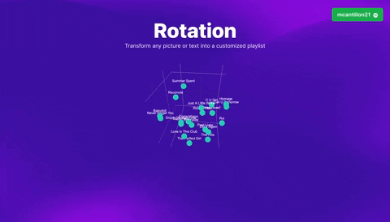

  <h1 align="center">Rotation: Image-to-Playlist Generator</h1>
  

  <a href="http://rotations.ai"><b>Live Website</b></a>
   | 
  <a href="https://twitter.com/mollycantillon/status/1653610387022176256?s=20"><b>Video Demo</b></a>
  

    

    
  

## About

Rotation is a revolutionary approach to music consumption. Generate a playlist from any picture using AI.  
Capture the nuances and inflections of your mood perfectly and display its quirks spatially. 

## Getting started

To run Rotation locally, follow these steps:

1. Clone the project repository to your local machine
2. Move to the repository: `cd Rotation`
3. Copy the contents of your `.env_example` file into your `.env` file, but fill in NEXT_PUBLIC [actually, maybe no env is needed if modal secrets are mentioned]
4. [TODO STEP ABOUT POETRY]
5. 

## How it works

Rotation uses CLIP, GPT-4 and Spotify seed recommendations to transform text or images into curated playlists. 

## License

Licensed under the [MIT license](LICENSE).
